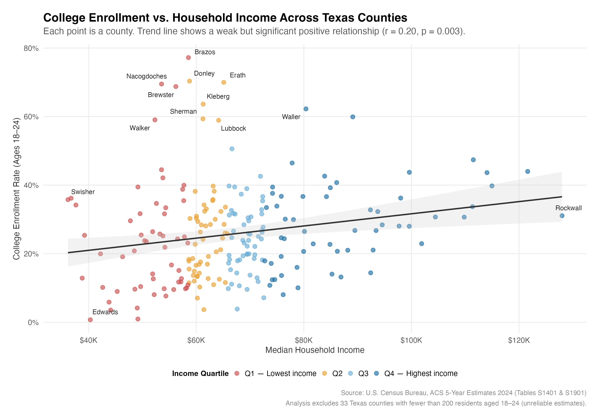
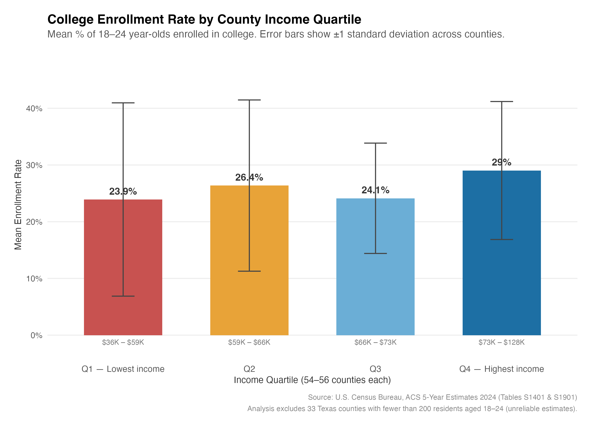
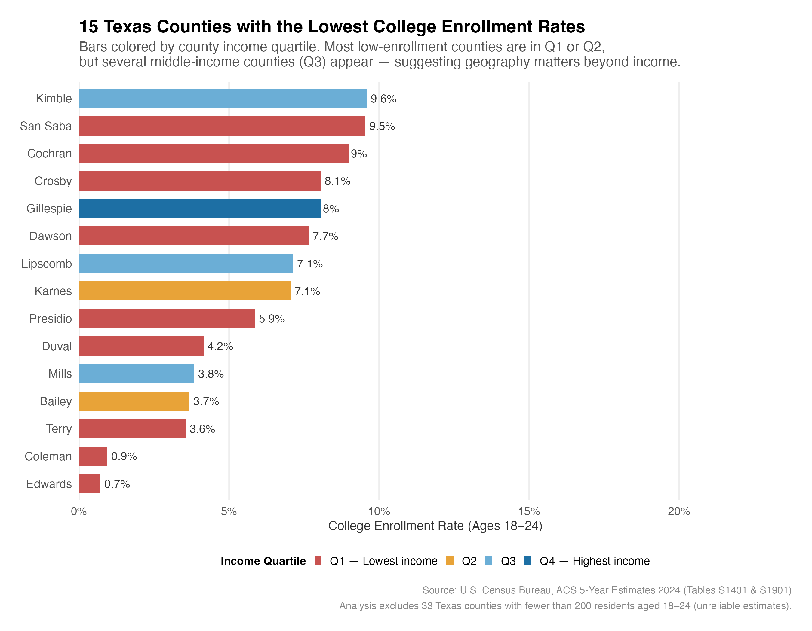
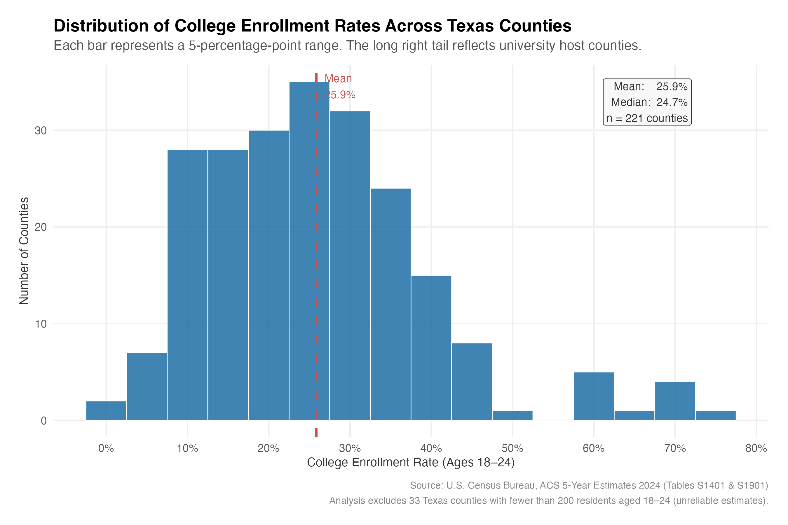

# Who Gets Access?
### Does household income predict whether young people in Texas go to college?

---

## Research Question

Does median household income at the county level predict college enrollment rates for 18–24 year-olds across Texas? And if income alone doesn't fully explain the gap, what else might?

---

## Key Findings

- **Income matters, but it's not the dominant factor.** The correlation between county-level median household income and college enrollment is statistically significant (r = 0.20, p = 0.003), but income explains only about 4% of the variation in enrollment rates across Texas counties. Something else, likely whether a county has a college nearby, is doing most of the work.

- **The income gap is real but modest.** Counties in the highest income quartile (median income $73K–$128K) enroll an average of 29% of their 18–24 year-olds in college, compared to 24% in the lowest quartile ($36K–$59K). That's a 5-percentage-point gap, meaningful but smaller than many would expect.

- **University towns dominate the top of the chart.** Brazos County (home to Texas A&M) has a 77% enrollment rate regardless of its median income. Erath and Nacogdoches counties follow the same pattern. Institutional presence, not household wealth, appears to drive the highest enrollment rates in the state.

- **Some middle-income counties have alarming access gaps.** Mills County (median income $68K, Q3) and Lipscomb County ($73K, Q3) both rank in the bottom 15 statewide for enrollment. Both are rural counties more than 100 miles from the nearest university. These counties complicate a simple income story and point toward geographic isolation as an independent barrier.

---

## Visualizations

**Income vs. Enrollment: Each dot is a Texas county**


**Average Enrollment Rate by Income Quartile**


**15 Counties with the Lowest Enrollment Rates**


**Distribution of Enrollment Rates Across All Texas Counties**


---

## Data Sources

All data is from the **U.S. Census Bureau American Community Survey (ACS), 5-Year Estimates (2019–2024)**, released 2024. Five-year estimates are used because they provide reliable figures for small geographies like rural Texas counties.

| Table | Description | Link |
|-------|-------------|------|
| S1401 | School Enrollment by Age | [data.census.gov](https://data.census.gov/table/ACSST5Y2024.S1401) |
| S1901 | Income in the Past 12 Months | [data.census.gov](https://data.census.gov/table/ACSST5Y2024.S1901) |

---

## Methodology

**1. Data preparation:** Raw ACS tables were downloaded as CSVs directly from data.census.gov. These files are structured with counties as columns and demographic categories as rows, the opposite of a standard analysis-ready format. The cleaning script reshapes them, extracts the two key variables (18–24 enrollment count and median household income), and joins the tables by county name.

**2. Data quality:** ACS estimates for counties with very small youth populations are statistically unreliable. Thirty-three counties with fewer than 200 residents aged 18–24 were flagged and excluded from statistical analysis (but kept in the dataset for transparency). Fourteen counties where Census suppressed the enrollment count (recorded as zero rather than a true absence of students) were recoded as missing rather than zero to avoid artificially deflating the correlation.

**3. Analysis:** Descriptive statistics were calculated for all 221 remaining counties. Counties were divided into four equal income groups (quartiles) and average enrollment rates were compared across groups. A Pearson correlation tested the linear relationship between income and enrollment, and the 10 lowest-enrollment counties were identified and examined alongside their income levels.

**4. Visualization:** Four charts were produced in ggplot2: a scatter plot showing the full income–enrollment relationship with labeled outliers, a bar chart comparing enrollment by income quartile, a ranked list of the lowest-enrollment counties colored by income group, and a histogram of the overall enrollment distribution.

---

## Tools

R: `readr`, `dplyr`, `tidyr`, `stringr`, `tidycensus`, `ggplot2`, `ggrepel`, `scales`

---

## Project Structure

```
Who Gets Access/
├── data/                   # Raw ACS CSV files (unmodified)
├── output/                 # Charts and summary tables
├── 01_clean_data.R         # Data loading, reshaping, and quality checks
├── 02_analysis.R           # Descriptive stats, correlation, quartile analysis
├── 03_visualizations.R     # ggplot2 charts
└── README.md
```

---

## About the Author

Jonathan is a sociologist and data analyst with a focus on education equity and social policy. His work sits at the intersection of quantitative research and community-level outcomes, using publicly available data to surface patterns that aren't always visible in aggregate statistics. He has applied these methods across research and program contexts in the education sector, with a particular interest in the structural factors that shape access to postsecondary opportunity.
